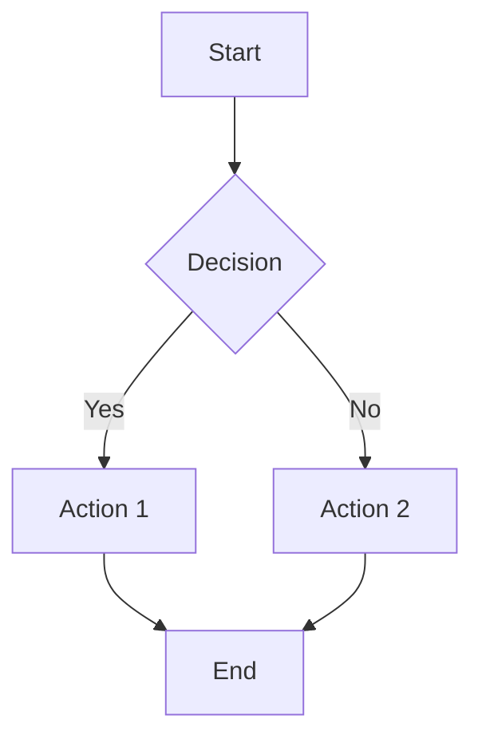
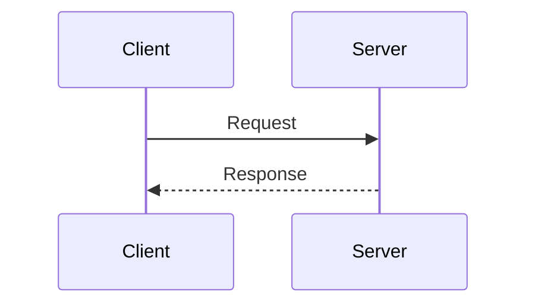
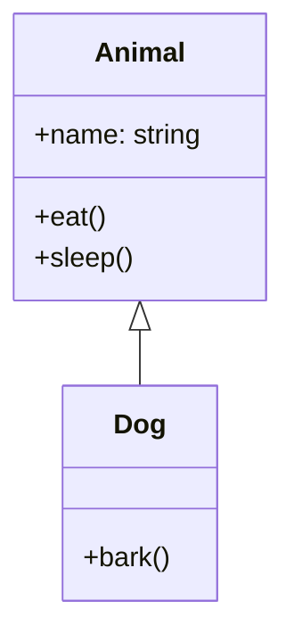
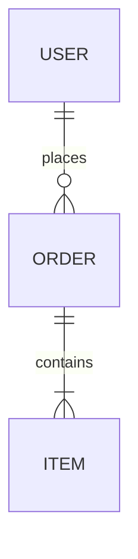

# Mermaid Diagram Skill

Generate professional diagrams using Mermaid syntax via MCP.

## Supported Diagram Types

1. **Flowchart** - Process flows, decision trees
2. **Sequence Diagram** - Interactions between components
3. **Class Diagram** - OOP class structures
4. **ER Diagram** - Database entity relationships
5. **State Diagram** - State machines
6. **Gantt Chart** - Project timelines
7. **Pie Chart** - Data distribution
8. **Git Graph** - Branch visualization

## Usage

Use the MCP tool `mcp__mermaid__generate` with parameters:
- `code`: Mermaid diagram code
- `outputFormat`: "png" or "svg"
- `folder`: Output directory (default: /tmp)
- `name`: Output filename (without extension)
- `theme`: "default", "dark", "forest", "neutral"

## Syntax Examples

### Flowchart

### Sequence Diagram

### Class Diagram

### ER Diagram

## Best Practices

1. Keep diagrams focused and not too complex
2. Use meaningful node labels
3. Group related elements
4. Use appropriate diagram type for the content
5. Add comments for complex logic
